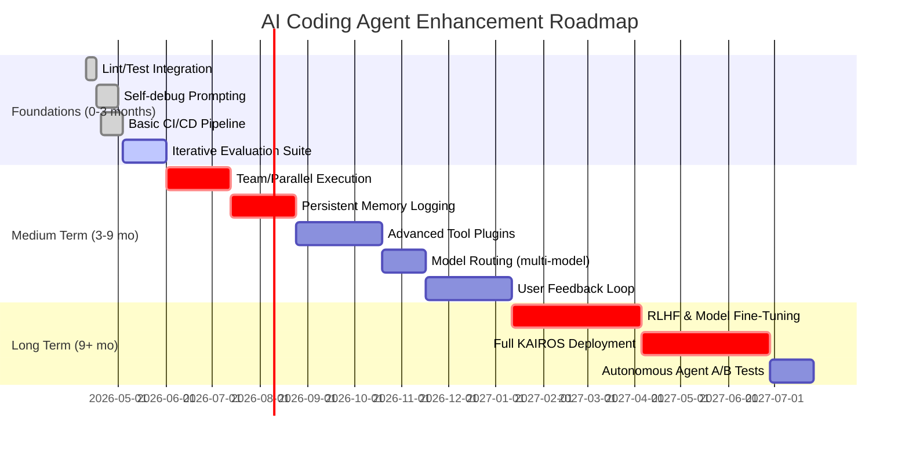

# Executive Summary  
Recent analysis of leaked *Claude Code* sources and open-source agent frameworks reveals powerful patterns and untapped features for coding assistants. The leaked Claude Code harness (512K lines) shows a **plugin architecture** with 40+ tools (each with fine-grained permissions), a **context-compression engine** for memory, **multi-model orchestration** (e.g. offloading planning to a stronger model), and **feature-flagged hidden features** (e.g. an always-on persistent agent “KAIROS”, an AI companion “BUDDY”, voice, browser tools, etc.)【3†L232-L240】【5†L153-L162】. In parallel, community projects have clean-room reimplemented Claude Code (ultraworkers/claw-code) using **Rust/Python** and an agent scaffold called *oh-my-codex* (OmX) to orchestrate multi-agent workflows【23†L372-L381】【26†L423-L432】. Oh-My-Codex introduces structured prompts (e.g. `$deep-interview`, `$ralplan`, `$team`, `$ralph`) and durable state (`.omx/` store plans, memory, logs) to improve multi-turn coding tasks【26†L498-L502】【26†L469-L477】.

**Gaps vs. Best Practices:**  Compared to ideal coding agents, these systems lack some tools (e.g. automated linters, type-checkers, code testers), formal test harness integration, and robust CI/CD pipelines. They rely on user “continue” prompts rather than self-verification, and have only basic telemetry. Best practices suggest adding iterative **self-debug** loops (explain & refine)【31†L90-L99】, **unit testing and static analysis** steps【29†L53-L61】【31†L90-L99】, **grounded retrieval** of documentation or code snippets, and **memory**/context management for long-term project state【35†L39-L47】【3†L232-L240】. Moreover, techniques like **RLHF fine-tuning** for code correctness and reflection, multi-agent planning (as in ULTRAPLAN/Coordinator), and evaluation metrics (pass@k, build success, coverage) are opportunities for improvement.

**Enhancements:** We recommend engineering improvements along three axes: (1) **Prompt & Workflow Engineering**: Adopt multi-stage prompts (clarification, plan, execute, review) with system-message **chain-of-thought** templates【31†L90-L99】【26†L489-L498】. Introduce decomposition (e.g. “$deep-interview” to clarify requirements, “$ralplan” to generate and approve a plan, then “$team” or “$ralph” for parallel or iterative execution)【26†L489-L498】. Bake in *explanation-with-refinement* prompting to debug code against unit tests【31†L90-L99】. (2) **Toolchain Expansion**: Integrate linters (e.g. `flake8`, `mypy`), static analyzers (e.g. `eslint`, `clang-tidy`), type-checkers, and sandboxed **code execution** tools for test runs. Use AI-driven test **generators** and CI pipelines to auto-verify output【29†L53-L61】【31†L90-L99】. (3) **Evaluation & Monitoring**: Define metrics for code correctness (test pass rates, style compliance, build success) and agent behavior (tool usage frequency, planning accuracy). Embed automated evals (unit tests, LLM-graders) and logging in CI/CD【29†L53-L61】【28†L142-L150】. Example experiments: A/B test prompts with vs. without self-debug instructions, or with static analysis feedback, and measure code quality improvements.  

The **roadmap** (below) prioritizes quick wins (lint/tool integration, prompt templates) in the short term, planning/parallel execution layers mid-term, and advanced memory/RL training long-term. Success is tracked via measurable milestones (e.g. reduced bug rates, higher test pass rates) and continuous evaluation. A comparison table (Table 1) summarizes each source’s features versus ideal capabilities. Sample prompts, test cases, CI snippets, and mermaid diagrams illustrate recommended workflows.

**Key Sources:** We draw primarily on the Claude Code leak analysis【3†L232-L240】【5†L153-L162】, the Claw Code reimplementations【23†L372-L381】【26†L498-L502】, and AI agent best practices【29†L53-L61】【31†L90-L99】. These inform a concrete plan to build a more capable coding assistant.  

## 1. Findings from the Claude Code Leak and Open-Source Harnesses  

**Claude Code Architecture (leaked sources)**.  The leaked Anthropic *Claude Code* (v2.1.88) is a sophisticated agentic CLI tool with ~512K lines. It uses **Bun** (for fast startup) and **React Ink** to render a terminal UI【3†L225-L233】. Its core “Query Engine” (~46K lines) manages context with **three-layer compression** (dynamic retention/pruning) and orchestrates tools【3†L232-L240】. Over 40 built-in tools exist (e.g. file editor, terminal, AI search, etc.), each defined with its own schema and **fine-grained permission checks** – more like plugins than one monolith【3†L232-L240】. The system also collects detailed telemetry (e.g. inferred frustration signals, how often users hit “continue”)【3†L242-L245】.

Key **hidden features** uncovered include:
- **BUDDY**: A virtual AI “pet” companion with species, stats (DEBUGGING, PATIENCE, etc.), deterministically assigned per user, intended as a gamified interface (planned April/May 2026)【1†L76-L85】【3†L229-L240】.
- **KAIROS**: An *always-on* autonomous agent mode (flagged off in public code) that passively observes user work, logs daily appends, and can trigger actions proactively (“at night, it runs a ‘dreaming’ process” to prune memory)【1†L118-L126】【3†L229-L240】. This suggests a design for persistent context and background planning.
- **ULTRAPLAN / Coordinator Mode**: A multi-model planning system where a human can **approve a generated plan** (offloaded to a stronger Claude Opus model) before execution【5†L153-L162】. Coordinator Mode spawns a small “team” of agent workers: one main agent routes subtasks to parallel workers and reconciles results【5†L153-L162】.
- **Other flagged tools**: Voice interaction (`VOICE_MODE`), in-CLI web browsing (`WEB_BROWSER_TOOL`), background daemon mode (`DAEMON`), and event-based triggers (`AGENT_TRIGGERS`) are present but disabled【5†L167-L174】.
- **Undercover Mode**: If a user is an Anthropic employee (`USER_TYPE==='ant'`), the agent runs stealthily on public repos: stripping “Co-authored-by” metadata and using a system prompt to never reveal it’s an AI【3†L186-L194】. This raises transparency/safety questions.

Critically, all unreleased features were **fully implemented behind flags**, not just stubs【5†L167-L174】【3†L265-L274】. The public documentation omits these. The design implies *multi-model orchestration* (planning with Opus, parallel workers) and persistent memory (KAIROS), which are powerful concepts for coding agents.

**Claw Code (open-source porting and harness)**.  The ultraworkers’s [Claw Code](https://github.com/ultraworkers/claw-code) is a community rewrite (Rust plus Python) of Claude Code’s agent harness【23†L372-L381】【23†L435-L444】. Its goal is to understand and replicate the original’s “harness, tool wiring, and workflow.” The repository splits into:
- A **Rust workspace** (`crates/`) for the runnable CLI and plugins.
- A **Python porting workspace** (`src/`) that currently provides a “manifest” of the architecture and partial behavior【23†L372-L381】【23†L427-L433】.
- An extensive **test suite** (`tests/`) for verifying the ported logic.

This rewrite was done using *Yeachan Heo’s* **oh-my-codex** (OmX) framework, illustrating agent orchestration in practice【23†L435-L444】. The `src/` has modules (`commands.py`, `tools.py`, `query_engine.py`, etc.) that mirror the leaked system (e.g. `QueryEngine.py`, `Tool.py`, `permissions.py` exist in the TypeScript code). The port includes a **parity audit** tool to compare the Python workspace against an archived snapshot of the original, ensuring functional equivalence【7†L454-L462】【23†L427-L433】.

Notably, the README describes workflow patterns used via OmX:
- **$team mode**: parallel review, architectural feedback (e.g. multiple agents validating code sections).
- **$ralph mode**: persistent execution loop with discipline (akin to iterative refinement until a goal).
- **Codex-driven workflows**: using LLMs to assist coding tasks.  

The tools built for this port (OmO/OmX) orchestrated generation, naming/branding cleanup, QA, and release validation【7†L475-L483】【23†L435-L444】. This indicates how an open agent system can use AI to structure its own development. The port is ongoing – it “mirrors the original root entry surface” but is not yet fully executable【23†L427-L433】.

**Oh-My-Codex (OmX) Framework**.  Oh-My-Codex is an AI “workflow layer” built on OpenAI’s Codex CLI【26†L394-L402】. It does **not** replace Codex, but wraps it with structured prompt templates, roles, and state management【26†L463-L472】. Key features:
- **Prompts/Skills**: Defines higher-level commands (talents) like `$deep-interview`, `$ralplan`, `$team`, `$ralph`, which embed planning, decomposition, and parallelism【26†L489-L498】【26†L498-L502】.
- **Durable State**: Keeps project context, logs, plans under a `.omx/` directory (memory of decisions, transcripts)【26†L465-L474】.
- **Team Runtime**: Supports multi-agent execution via `tmux` on Unix (or `psmux` on Windows) so that multiple LLM agents can work in parallel and coordinate【26†L529-L538】.
- **Operator Surfaces**: Provides utilities like `omx explore` (codebase queries), `omx doctor` (health check), `omx hud` (monitoring UI), and `omx sparkshell` (shell inspections)【26†L522-L530】.
- **Workflows**: Recommends a default flow: clarify with `$deep-interview`, plan with `$ralplan`, then execute with `$team` or persist with `$ralph`【26†L489-L498】.
  
Oh-My-Codex essentially codifies a multi-stage planning/execution pipeline and agent coordination. It aligns closely with the Claude Code *Coordinator Mode* concept. By leveraging OmX, the Claw Code port achieved coordinated parallel review and disciplined completion loops【23†L435-L444】. As such, it is a concrete example of an advanced *coding agent scaffold* with memory and orchestration.

**Summary of Source Features:** The leaked Claude Code shows a **reactive CLI agent** with powerful hidden capabilities (KAIROS memory, multi-agent coordination)【5†L153-L162】【3†L229-L240】. Ultraworkers’ Claw Code implements a **similar harness** and demonstrates how one can orchestrate LLMs in Python/Rust using prompt-driven workflows【23†L372-L381】【23†L435-L444】. Oh-My-Codex illustrates structured agent workflows (QA clarifying, planning, parallel execution, logging) that match the uncovered architecture【26†L489-L498】【26†L469-L477】. However, none of these sources explicitly address **tool libraries for code quality (linters, type-checkers)**, nor do they provide a complete end-to-end **CI/test framework**. **Safety/guardrails** (aside from Undercover mode) are minimal, and *external knowledge retrieval* (docs search) is unmentioned. 

## 2. Comparison to Best Practices for AI Coding Agents  

Modern research and industry guidance outline **best practices** for autonomous coding assistants. We compare those to the sources:

- **Tool Use & External Interfaces:** Best practice is for agents to call out to tools (command-line shells, IDEs, compilers, web search) as needed【5†L167-L174】【26†L529-L538】. Claude Code already has ~40 integrated tools (file editor, git, wiki search, etc.)【3†L232-L240】. However, none of the sources explicitly mention integrating **static analysis** or **linting** tools, which are crucial for catching bugs early. We recommend adding such tools to the agent’s palette (e.g. `mypy`, `pytest`, `eslint`) so the LLM can verify style and type safety. Retrieval of documentation is implicit (e.g. a `web_browser` tool exists), but best practice suggests also hooking in code-search or knowledge-base retrieval to ground the agent’s answers.

- **Unit Testing & Verification:** A critical best practice is to **automatically run and analyze tests**. The Anthropic eval framework explicitly uses unit tests to grade code-generation tasks【29†L54-L61】. The “Answer→Test→Refine” loop (generate code, run tests, refine on failure) is a well-known pattern【31†L90-L99】【29†L54-L61】. Claude Code’s harness does not show any built-in test runner or test-driven prompts. We should integrate a test executor tool and a prompt that *parses test failures*, asks the model to explain the bug (chain-of-thought), and re-run refinement until success【31†L90-L99】.

- **Iterative Refinement & Self-Debugging:** Research shows that prompting models to **explain bugs and self-debug** improves correctness【31†L90-L99】. For example, “First explain why the code failed, then produce a fixed version” has been effective【31†L90-L99】. AgentCoder and ThinkCoder extend this to multi-turn, multi-agent interactions【33†L82-L89】. We should embed such patterns in prompts (akin to $\mathbf{Chain\ of\ Thought}$ reasoning) and possibly finetune models or use RLHF to reward successful fixes. None of the sources describe this explicitly, but oh-my-codex’s iterative team/ralph modes are conceptually similar to iterative passes【26†L489-L498】【31†L90-L99】.

- **LLM Chaining and Multi-Agent Decomposition:** Modern frameworks chain LLM calls (e.g. separate planning vs execution LLMs) and use multiple specialized agents. Claude’s ULTRAPLAN and Coordinator Mode already do **model routing and parallel agents**【5†L153-L162】. Oh-My-Codex’s `$team` uses multiple workers. Best practice reinforces this: use a strong model for planning and others for tasks【3†L232-L240】【5†L153-L162】. Implementable improvement: allow the agent to choose different models (small for quick tasks, large for planning), as the leaked code implies.

- **Memory & Context Management:** The **KAIROS** concept illustrates *persistent memory* across sessions【3†L229-L240】. Recent guidance emphasizes carefully managing context (Anthropic’s “context engineering” blog) to maximize relevant info【35†L114-L122】【3†L232-L240】. Best practice: maintain a project memory (past conversations, architecture docs) and periodically summarize/condense it to stay within context window. We should add memory hooks (like periodic saving of logs, KAIROS-like “dreaming” to prune) to the agent.

- **Prompt Engineering & Grounding:** Anthropic suggests minimal, clear system prompts with organized sections【35†L112-L121】. Claude’s Undercover mode shows dangers of obfuscation. We should ensure transparency and grounding in prompts (e.g. always cite sources, mention being an AI). Include system templates that enforce context clarity and reveal nothing adverse. Also, grounding means including relevant code/project snippets in prompts or retrieving them on demand, which Claude Code’s context engine partially handles【3†L232-L240】.

- **RLHF and Alignment:** None of the sources directly mention fine-tuning with human feedback on code tasks, but state-of-the-art practices (e.g. Codex RLHF for code) improve following of instructions and code quality. We can incorporate RLHF by using human-labeled quality data or simulated feedback (test pass as reward) to refine the agent’s responses (cf. [31†L90-L99] using reinforcement on refinement quality).

- **Evaluation Metrics:** Key metrics include **code correctness** (test pass, build success), **efficiency** (tokens used, latency), **tool usage patterns** (overuse or ignoring), and **safety** (prompt injection resilience). Maxim.ai suggests coding metrics like test coverage and build pass rate【28†L142-L150】. We should track these (e.g. use CI logs, static analysis violation counts) to benchmark agent improvements. The Anthropic eval approach stresses transcripts and automated graders【29†L70-L79】.

In summary, **Claude Code’s harness covers many advanced design points** (context compression, plugin tools, model routing)【3†L232-L240】【5†L153-L162】, but it omits explicit test/evaluation integration and additional code-quality tools. The Claw Code ports and OmX introduce multi-agent workflows and prompt structures, yet also lack built-in QA loops. We must fill these gaps with well-known agent practices: iterative self-check, tool use for code quality, retrieval grounding, persistent memory, and rigorous automated evaluation. Table 1 below contrasts each source’s features with ideal agent attributes. 

## 3. Recommended Enhancements  

Based on the above, we propose the following concrete enhancements. For each, we detail the **rationale**, **impact**, **steps to implement**, **resources needed**, **risks**, and **success criteria**.

### 3.1 Prompt Engineering Enhancements  
- **Clarification Prompts ($deep-interview$):** Introduce an initial “deep interview” step where the agent explicitly asks clarifying questions or restates requirements. This ensures understanding of ambiguous tasks (as done in Oh-My-Codex)【26†L489-L498】. *Rationale:* Clearer specs reduce wasted work and errors. *Impact:* Fewer misinterpretations; tasks scoped more precisely. *Steps:* Add a `$deep-interview` mode where Claude first outputs questions or assumptions. Use partial user input to formulate follow-up queries. *Resources:* Develop prompt templates and possible user prompts. *Risks:* Lengthens dialogue; user may skip. *Success:* Increased task success ratio; measurable via reduced revisions or higher correctness in evals.

- **Planning Step with Approval ($ralplan$/Ultraplan):** Embed a two-stage workflow: **plan generation** then **approval** before coding. Use a stronger model (Claude Opus) to create a step-by-step plan, present to the user or a verifier, and *then* allow execution. This mimics “ULTRAPLAN”【5†L153-L162】. *Rationale:* Planning for complex tasks prevents rework (especially if plan is wrong). *Impact:* Higher first-try code success; better alignment to goals. *Steps:* Add prompt like `$ralplan “Propose an implementation plan”`. The agent outputs bullet points. Either the same or a second model reviews/approves. *Resources:* Possibly need UI or prompt for user check. *Risks:* Extra overhead/time, if plan is faulty it could mislead. *Success:* Compare with/without plan on tasks; success=plan followed by correct code in majority of cases.

- **Multi-Agent Execution ($team$ mode):** For large tasks, spawn parallel “sub-agents” (as in Coordinator Mode【5†L153-L162】 and OmX’s `$team`) to tackle subproblems (e.g. one agent writes code, another writes tests, another does refactoring). *Rationale:* Parallelism speeds up completion and allows specialized focus. *Impact:* Faster throughput on big tasks; improved diversity of ideas. *Steps:* Implement a “team” command where the agent forks (via tmux) into separate threads. Each thread receives a subtask (manually defined or auto-decomposed). *Resources:* Setup multi-session environment (like OmX’s `tmux`), coordinate outputs. *Risks:* Overhead synchronizing; potential merge conflicts. *Success:* Measure wall-clock completion time vs sequential.

- **Persistent Agent Memory (KAIROS) Draft:** While full always-on is long-term, start by logging conversations, decisions, and code changes. Periodically summarize and feed back into context. E.g. at session end, save a “log digest” and prepend to next session prompt. *Rationale:* Maintains context across sessions; prevents forgetting design decisions. *Impact:* Greater consistency; less need to re-explain. *Steps:* Implement a simple log file and summarization step (either via LLM or template). *Resources:* Storage for `.codememory` and a summarization model or code. *Risks:* Context growth; potentially outdated info if not pruned. *Success:* User reports continuity (via survey) or fewer repeat queries.

- **Transparent System Prompts:** Remove hidden directives like “never mention you are AI” (from Undercover Mode) to maintain trust. Instead, use system prompts that enforce helpfulness and ethical boundaries explicitly【3†L186-L194】. *Rationale:* Ethical disclosure; avoids policy violations. *Impact:* Maintains user trust; aligns with best practices. *Steps:* Auditing existing prompt templates, ensure agent always self-identifies and logs usage. *Success:* Manual check that prompt excludes underhanded instructions.

### 3.2 Toolchain and Environment Additions  
- **Integrate Linters/Type-Checkers:** Add tools to automatically run linting (e.g. `pylint`, `flake8`) and type-checkers (`mypy`, `tsc`) on generated code. The agent can invoke these tools via plugins and incorporate their feedback. *Rationale:* Catch syntax/style/typing errors proactively. *Impact:* Cleaner, more robust code; fewer trivial bugs slip through. *Steps:* Extend tool schema to include linter; update permission logic (users must allow code inspection). Provide prompts that ask the agent to fix linter warnings. *Resources:* Installations of linters, extended tool definitions. *Risks:* May produce too many warnings or overwhelm the agent if it’s strict. *Success:* Pre-commit CI shows high lint compliance; reduction in code-run errors.

- **Automated Test Generation:** Equip the agent with the ability to generate unit tests (e.g. using LLM to write tests for functions) and/or integrate existing tests. The pipeline: agent writes code, then writes matching tests, runs them. *Rationale:* Ensures code correctness end-to-end. *Impact:* Immediate feedback on logic errors; higher confidence in output. *Steps:* Provide a `$gen-tests` or include “write unit tests” in tasks. Possibly integrate an LLM skill or use frameworks like `hypothesis`. *Risks:* Generated tests might be too trivial or fail to cover edge cases. *Success:* Increase in test coverage metrics; bugs caught before merging.

- **Static Analysis & Security Checks:** Include static analyzers (like `bandit` for Python security, `npm audit`) and sandboxing. After generation, the agent invokes a security audit to check for vulnerabilities. *Rationale:* Prevent insecure code or injection. *Impact:* More secure code; fewer exploitable bugs. *Steps:* Add `security_scan` tool hook; on failures, ask agent to fix code. *Success:* Zero high-severity findings on final code.

- **Sandboxed Execution:** Ensure any code-run is done in a restricted environment (e.g. container or chroot) to prevent malicious actions. *Rationale:* Safety. *Steps:* Use Docker or similar for the execution tool. *Success:* No harmful commands can escape.

- **Knowledge Retrieval:** Add a `code_search` or `doc_query` tool that can retrieve relevant docs or code examples from internal knowledge bases. *Rationale:* Grounds answers in real docs, avoids hallucinations. *Steps:* Hook into search APIs (StackOverflow, internal manuals) with vector embeddings for relevance. *Success:* Agent cites actual sources, fewer factual errors.

### 3.3 Workflow Orchestration & Process Enhancements  
- **Task Decomposition Prompt:** If a request is complex, prompt the agent to break it into sub-tasks (like “Given the request, divide into components”). *Rationale:* Clear planning. *Steps:* E.g. prepend “You are an assistant that first identifies subtasks.” *Success:* Observable plan breakdown; easier parallel assignment.

- **Tool Invocation Guidance:** In prompts, encourage the agent to explicitly mention which tool it should use (like a LLM-level “ReAct” style) e.g. “If you need to edit code, say [run-code-editor]”. *Rationale:* Improves traceability of actions; reduces black-box outputs. *Implementation:* Possibly adapt ReAct (Reason+Act) framework. *Success:* Interleaved "Thought: ..." and "Action: ..." logs.

- **Continuous Integration Hooks:** Integrate with CI/CD: every agent-generated PR triggers automated checks (tests, linters, security scan). *Rationale:* Ensures no erroneous code enters main branch. *Steps:* Configure GitHub Actions with steps: checkout, run linter, tests, static analysis. *Success:* Green build is required; metrics collected.

### 3.4 Evaluation & Monitoring Enhancements  
- **Automated Evals:** Build an evaluation suite (collection of coding tasks with expected outcomes/tests)【29†L53-L61】. Run the agent against these regularly to track performance. Use Anthropic’s eval definitions: *transcript*, *outcome*, *graders*【29†L68-L79】. For example, measure pass@k, execution time, number of tool calls. *Rationale:* Quantify improvements/regressions. *Success:* Achieve target pass rates on benchmarks (e.g., >X% on selected tasks).

- **Metrics Dashboards:** Monitor tool usage (over/under-use), plan accuracy vs. actual code, revision counts, etc. Use these to detect “hallucination” or drift. *Rationale:* Operational insight (as Maxim recommends multi-layer metrics【28†L135-L142】). *Success:* Dashboards live; periodic reviews show trends.

- **User Feedback Loop:** Solicit developer feedback on generated code (e.g. via inline comments or surveys), and use it (manually or automatically) to refine prompts or fine-tune the model. *Risk:* Requires human effort.

- **Prompt A/B Testing:** Systematically test variants of prompts (e.g. with/without self-debug instructions) and measure code quality differences. *Rationale:* Identify what prompt phrasing works best for coding tasks. *Implementation:* Use LLM-evaluator or even another LLM as judge to compare outputs on held-out tasks.

## 4. Prioritized Roadmap  

We propose a three-phase roadmap. Milestones include “CI with lint/tests”, “interactive planning mode”, “multi-agent runtime”, etc. The mermaid Gantt chart below outlines short- (weeks), medium- (months), and long-term (year) initiatives, with rough effort estimates.



- **Short-term (weeks):** Add linters/tests tools and CI, integrate self-debug prompt. Baseline success: CI builds passing on sample tasks, demonstration of prompt refinement loops.
- **Medium-term (months):** Implement multi-agent (`$team`) mode, persistent memory, and additional advanced tools. Milestones: parallel execution log from multiple agents, stable context summaries, new lint/static analysis usage.
- **Long-term (year+):** RL fine-tuning of model (using collected feedback and eval data), full always-on agent (KAIROS-like), extensive A/B benchmarking. Measure: significant jump in coded task success rate and stability.

## 5. Experiments and Evaluation  

We outline some experiments to validate enhancements:

- **Prompt Variation A/B Test:** For a set of coding tasks, compare **baseline prompts** vs. **enhanced prompts** (with debugging instructions). Metric: percentage of outputs that pass unit tests or static checks. (Use an LLM or automation to grade correctness【29†L54-L61】). Hypothesis: prompts with “Explain and fix errors” yield higher pass rates as per [31].

- **Tool Usage Impact:** Introduce a code linter tool to the agent, vs. control without it. Measure coding errors found at CI stage. Expect: With linter, a drop in lint violations and semantic bugs (the latter because agent learns to avoid them when feedback is given).

- **Parallel vs. Sequential Execution:** Assign a large coding task. Compare time and quality between `$team` (3 parallel agents working sub-tasks) and `$ralph` (one agent doing all). Track latency and code completeness. Expect reduced wall-clock time with similar quality in parallel mode.

- **Memory vs. No-Memory:** For multi-session tasks (same project), have agent sessions with vs. without context carryover (e.g. previous code snippet). Measure consistency in following earlier style or vocabulary. Expect better consistency with memory.

- **Evaluation Suite Regression Testing:** Add new code to the agent (e.g. new prompt or model change) and run an existing eval suite. Ensure any negative regressions are detected (e.g. sudden drop in pass rate on a test scenario).

**Sample Prompt (Self-debug Example):**  
```
User: "Implement a function to sort a list of numbers in Python."  
System: "Always include unit tests and debug any errors."  

$deep-interview: (Agent clarifies) "Should duplicates be kept? What sorting algorithm is acceptable?"  
... (user answers or default) ...  
$ralplan: "Plan: 1) Implement quicksort function; 2) Write unit tests checking ordering; 3) Validate and refine."  
$ralph: (Agent writes code per plan and tests)  
```
After running the code in a sandbox:  
```
Agent says: "One test failed due to off-by-one error. I'll explain: the loop condition was wrong. Now I fix it."  
(Agent produces corrected code with tests passing.)  
```
This exemplifies iterative chain-of-thought refinement【31†L90-L99】.

**Sample CI Snippet (GitHub Actions):** The pipeline runs lint, tests, and static analysis on each commit. In `.github/workflows/ci.yml`:  
```yaml
name: CI
on: [push, pull_request]
jobs:
  build:
    runs-on: ubuntu-latest
    steps:
      - uses: actions/checkout@v3
      - name: Set up Python
        uses: actions/setup-python@v4
        with: {python-version: '3.10'}
      - name: Install dependencies
        run: pip install -r requirements.txt
      - name: Run linter
        run: flake8 ./src
      - name: Run tests
        run: python3 -m pytest --maxfail=1 --disable-warnings -v
      - name: Static security scan
        run: pip install bandit && bandit -r src/
```
By enforcing this CI, every agent change is automatically vetted (success criteria: green builds, badge).

**Table 1** (below) summarizes features in each source vs. best practices/gaps:

| **Feature**                    | **Leaked Claude Code (wavespeed)**                 | **Claw Code (ultraworkers)**                                          | **Oh-My-Codex (OmX)**                    | **Best Practice (Desired)**                            |
|-------------------------------|----------------------------------------------------|----------------------------------------------------------------------|------------------------------------------|--------------------------------------------------------|
| **Framework**                 | Bun + React Ink (CLI UI)【3†L225-L233】             | Rust + Python (agent harness)【23†L372-L381】                        | Node/Codex CLI                          | Flexible multi-lang harness                            |
| **Tool Plugins**              | ~40 tools, per-tool perms, plugin-like【3†L232-L240】 | Mirrors original tools; actively porting tools list【23†L372-L381】  | Invokes CLI tools via commands          | Include compilers, linters, type-checkers, sandbox    |
| **Context Handling**          | 3-layer compression, dynamic pruning【3†L232-L240】  | Partial (manifest view); planned context engine                    | `.omx/` stores logs/plans              | Long-term memory, retrieval-augmented RAG             |
| **Planning/Coordinator**      | ULTRAPLAN (Opus planning)【5†L153-L162】; Coordinator (multi-agent)【5†L153-L162】 | Not built (porting focus)                                         | `$ralplan`, `$team`, `$ralph` workflow【26†L489-L498】 | Separate planning LLM, sub-agent orchestration         |
| **Iterative Refinement**      | User-driven (Continue button)                      | Not explicit                                                     | `$ralph` loop (persistent)            | Self-debug prompts & loops【31†L90-L99】                 |
| **Memory/Ambience (KAIROS)**  | Hidden behind flags (not user-available)【3†L229-L240】| No (stateless sessions)                                          | `.omx/` stores history【26†L465-L474】  | Persistent agent memory, summarization                |
| **Evaluation/Test Harness**   | None described                                      | Unit tests present; no integrated auto-grading                   | None (relies on user/testing)         | Automated unit tests, code reviews, CI checks         |
| **Feature Flags**             | 108 gated features; production flags【3†L264-L273】   | N/A (community port)                                             | Configurable skills/hardware options    | Use feature flags for A/B testing deployments         |
| **Multi-Model Usage**         | Uses Claude Opus for planning; routing implied【3†L274-L279】 | No (uniform model)                                              | Configurable via Codex CLI options      | Use different models per subtask (LLMs+specialists)   |
| **Telemetry/Logging**         | Tracks frustration, “continue” clicks【3†L242-L245】 | Not mentioned                                                   | Logging in `.omx/`                      | Usage stats, error rates, context drift monitoring    |
| **Prompt Templates/Design**   | Undercover mode prompt (AI denial)【3†L186-L194】   | No (cleaned out internal notes)                                  | Structured prompts for roles【26†L489-L498】| Clear system/user prompts; chain-of-thought          |
| **Safety/Guardrails**        | Undercover (controversial)【3†L186-L194】; no off-switch | Standard (no hidden modes)                                      | None specified                         | Output filtering, inject-safety, explicit disclosure |
| **CI/CD Integration**         | Not covered                                        | Uses Git tests; no CI pipeline mentioned                         | Not covered                            | Automated CI pipelines (lint/test/security)           |

*Table 1:* *Comparison of features in provided sources vs. best practices. Blanks indicate features not explicitly present or detailed in that source.*  

## 6. Conclusion  

The leaked Claude Code and community ports reveal advanced coding-assistant architecture (context compression, multi-agent coordination, feature flags) that surpass many existing tools. However, to truly match best practices, we must incorporate automated verification (linters, tests, CI), iterative self-debugging prompts, memory/context management, and robust evaluation frameworks【29†L53-L61】【31†L90-L99】. The proposed enhancements and roadmap offer a concrete path: start with prompt patterns and tool integration, then build towards autonomous planning and memory. Experiments as outlined will validate each step. Ultimately, these steps will yield an AI coding agent that writes correct, efficient, and secure code with minimal human oversight.  

